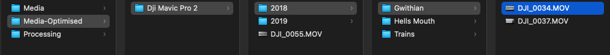

# Auto-Optimiser
Auto Optimiser utilises the [Handbrake CLI](https://handbrake.fr/downloads.php) to convert and compress media files.  
Any file structures placed in the input folder will be replicated in the output folder.  
This can be run multiple times and will only optimise newly added files (provided the output files are left in place).  
This also makes use of Discord webhooks to give live feedback on how the optimising sessions are going.

## Installation

[comment]: <> (Originally compiled with Azul Zulu: 17.32.13 to run on an ARM 64-bit based Mac)
In [Main](src/main/java/com/me/ladster/Main.java), configure your input, output & processing folder locations.  
At the top of the file, enter your discord webhook urls which can be found on discord in:  
`Server Settings -> Integrations -> Webhooks -> New Webhook`  
Once built, you can optionally automate the execution of the application to run every night, on macOS this can be done through calendar events.

## Usage
Simply double-click the application to start the optimising session.

Example of discord notification webhook in action:  
 

Finished notification:  
 

Unoptimised Files:  
 

Optimised Files:  
 

## License
[MIT](https://choosealicense.com/licenses/mit/)